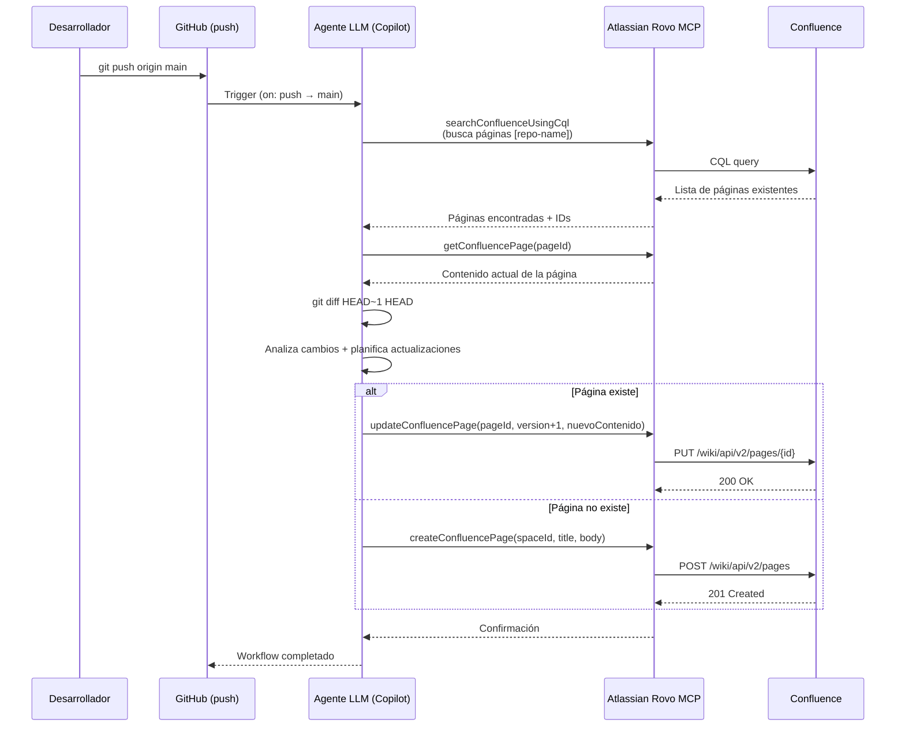

# Agentic Workflows — Documentación Viva en Confluence

Solución de documentación automatizada que mantiene **activa la base de conocimiento de cada proyecto en Confluence**. En cada `push` a `main`, un agente LLM (GitHub Copilot) lee el estado actual de la documentación, analiza los cambios del código y actualiza inteligentemente las páginas correspondientes. Diseñada para implementarse en **N repositorios** de la organización.

---

## Tabla de Contenidos

- [Arquitectura](#arquitectura)
- [Por qué MCP y no REST API directa](#por-qué-mcp-y-no-rest-api-directa)
- [Componentes de la Solución](#componentes-de-la-solución)
- [Requisitos Previos](#requisitos-previos)
- [Configuración de Secretos y Variables](#configuración-de-secretos-y-variables)
- [Guía de Implementación para Repositorios Consumidores](#guía-de-implementación-para-repositorios-consumidores)
- [Flujo de Ejecución](#flujo-de-ejecución)
- [Páginas que mantiene el agente](#páginas-que-mantiene-el-agente)
- [Personalización](#personalización)
- [Alternativa sin MCP (fallback REST API)](#alternativa-sin-mcp-fallback-rest-api)
- [Troubleshooting](#troubleshooting)

---

## Arquitectura

La solución usa el **Atlassian Rovo MCP Server** (`https://mcp.atlassian.com/v1/mcp/authv2`) directamente desde el agente `gh-aw`. Esto es posible porque el servidor MCP de Atlassian es un servicio HTTP remoto con soporte de autenticación headless via API token, compatible nativamente con la directiva `mcp-servers: type: http` de `gh-aw`.

```
┌──────────────────────────────────────────────────────────────────────────┐
│                        GitHub Actions (on: push → main)                  │
├──────────────────────────────────────────────────────────────────────────┤
│                                                                          │
│  ┌────────────────────────────────────────────────────────────────────┐  │
│  │  Job: Agente LLM (GitHub Copilot)                                  │  │
│  │                                                                    │  │
│  │  ① Lee documentación existente ──────────────────────────────────► │  │
│  │     getConfluencePage / searchConfluenceUsingCql                   │  │
│  │                                      ▲                             │  │
│  │  ② Analiza git diff + git log        │  Atlassian Rovo             │  │
│  │     bash: git diff HEAD~1 HEAD       │  MCP Server                 │  │
│  │                                      │  https://mcp.atlassian.com  │  │
│  │  ③ Decide qué crear / actualizar     │                             │  │
│  │     (contexto de ① + ②)              │                             │  │
│  │                                      │                             │  │
│  │  ④ Publica en Confluence ────────────┘                             │  │
│  │     createConfluencePage / updateConfluencePage                    │  │
│  └────────────────────────────────────────────────────────────────────┘  │
│                                                                          │
│  ┌────────────────────────────────────────────────────────────────────┐  │
│  │  Safe Output (si MCP falla)                                        │  │
│  │  create-issue → issue de GitHub con contenido para revisión manual │  │
│  └────────────────────────────────────────────────────────────────────┘  │
│                                                                          │
└──────────────────────────────────────────────────────────────────────────┘
```

### Principios de Diseño

| Principio | Implementación |
|-----------|---------------|
| **Documentación viva** | El agente lee el estado actual antes de escribir; actualiza solo lo que cambió. |
| **Contexto antes de acción** | El agente nunca escribe a ciegas — siempre lee las páginas existentes primero. |
| **Mínimo privilegio MCP** | El `allowed:` list restringe el MCP a solo herramientas Confluence (no Jira, no Compass). |
| **Fallback seguro** | Si el MCP falla, el agente crea un issue de GitHub con el contenido para revisión manual. |
| **Reutilización** | Un único `auto-release-notes-caller.md` instalable en N repositorios. |

---

## Por qué MCP y no REST API directa

La primera versión de esta solución usaba un Safe Output Job personalizado con la REST API v1 de Confluence. Se migró al MCP de Atlassian por las siguientes razones:

| Aspecto | REST API pura (enfoque anterior) | MCP de Atlassian (actual) |
|---------|----------------------------------|--------------------------|
| **Lectura previa** | No — el agente escribía sin conocer el estado actual | Sí — el agente lee antes de actualizar |
| **Actualizaciones inteligentes** | No — sobreescritura completa | Sí — actualiza solo secciones afectadas |
| **Mantenimiento** | JavaScript personalizado a mantener | API oficial de Atlassian |
| **Autenticación headless** | API token básico (email + token) | Rovo MCP scoped token |
| **Alcance** | Solo publish (escritura ciega) | Read + Write con contexto |
| **Trazabilidad** | Logs de Actions | Audit log de Atlassian Administration |

> **Nota**: Si tu organización no tiene acceso al Rovo MCP Server, el componente `shared/confluence-publisher.md` provee el enfoque anterior como alternativa. Ver [Alternativa sin MCP](#alternativa-sin-mcp-fallback-rest-api).

---

## Componentes de la Solución

### Estructura de archivos

```
.github/
├── workflows/
│   ├── shared/
│   │   └── confluence-publisher.md            # Fallback: Safe Output Job con REST API v1
│   ├── auto-release-notes.md                  # Workflow principal — fuente de verdad (editar aquí)
│   ├── auto-release-notes.lock.yml            # Compilado — generado por `gh aw compile` (no editar)
│   ├── auto-release-notes-caller.md           # Workflow caller para repos consumidores
│   ├── auto-release-notes-caller.lock.yml     # Compilado — generado por `gh aw compile` (no editar)
│   └── copilot-setup-steps.yml                # Setup del entorno Copilot
├── agents/
│   └── agentic-workflows.md                   # Agente dispatcher
├── mcp.json                                    # Configuración MCP local (dev)
└── skills/
    └── agentic-workflows/
        └── SKILL.md                            # Skill router
```

### `auto-release-notes.md` — Workflow Principal

Workflow agéntico completo. Integra el Atlassian Rovo MCP para lectura y escritura de páginas Confluence. Contiene el prompt detallado con las 5 fases de ejecución.

### `auto-release-notes-caller.md` — Workflow Caller

Versión compacta para repos consumidores. Misma configuración MCP, prompt conciso.

### `shared/confluence-publisher.md` — Fallback REST API

Componente alternativo que publica en Confluence via REST API v1 usando un Safe Output Job determinista. Usar cuando el Rovo MCP Server no esté disponible en la organización.

---

## Requisitos Previos

1. **GitHub CLI con extensión gh-aw**:
   ```bash
   gh extension install github/gh-aw
   ```

2. **Acceso a GitHub Copilot** en la organización.

3. **Atlassian Cloud** con Confluence. El admin de la organización debe:
   - Habilitar autenticación via API token para el Rovo MCP Server en **Atlassian Administration → Rovo MCP Server settings**.
   - Documentación oficial: [Configure authentication via API token](https://support.atlassian.com/atlassian-rovo-mcp-server/docs/configuring-authentication-via-api-token/)

4. **Rovo MCP scoped API token**: Generar un token con scope limitado a Confluence desde el perfil de usuario Atlassian.

---

## Configuración de Secretos y Variables

Cada repositorio consumidor necesita configurar en **Settings → Secrets and variables → Actions**:

### Secrets

#### Requeridos

| Secret | Descripción | Cómo obtenerlo |
|--------|-------------|----------------|
| `ATLASSIAN_ROVO_MCP_TOKEN` | Token Bearer para autenticar contra el MCP Server de Atlassian Rovo (`https://mcp.atlassian.com/v1/mcp/authv2`). | Generar en Atlassian profile settings. Requiere que el admin habilite autenticación headless en **Atlassian Administration → Rovo MCP Server settings**. |
| `COPILOT_GITHUB_TOKEN` | Token de GitHub Copilot para el engine de IA. | **Auto-gestionado por `gh-aw`** — no configurar manualmente. Lo provee la plataforma. |
| `GITHUB_TOKEN` | Token estándar de GitHub Actions para leer repos, issues y PRs. | **Auto-inyectado por GitHub Actions** — no requiere configuración. |

#### Opcionales (solo con fallback REST API vía `confluence-publisher.md`)

| Secret | Descripción |
|--------|-------------|
| `CONFLUENCE_USER_EMAIL` | Email de la cuenta de servicio de Atlassian. |
| `CONFLUENCE_API_TOKEN` | Token de API clásico de Atlassian, generado en [id.atlassian.com](https://id.atlassian.com/manage-profile/security/api-tokens). |

#### Opcionales avanzados (normalmente no se configuran manualmente)

| Secret | Descripción |
|--------|-------------|
| `GH_AW_GITHUB_TOKEN` | Token alternativo para el GitHub MCP Server. Si no existe, usa `GITHUB_TOKEN`. |
| `GH_AW_GITHUB_MCP_SERVER_TOKEN` | Token específico para el GitHub MCP Server (más granular). Fallback: `GH_AW_GITHUB_TOKEN` → `GITHUB_TOKEN`. |

### Variables

| Variable | Obligatorio | Valor por defecto | Descripción |
|----------|-------------|-------------------|-------------|
| `COPILOT_MODEL` | No | `gpt-4o` | Modelo LLM a usar. Valores posibles: `gpt-4o`, `gpt-4.1`, `o3`, `claude-sonnet-4-5`. Si no se configura, usa `gpt-4o`. |
| `GH_AW_DEFAULT_MAX_AI_CREDITS` | No | `1000` | Límite de créditos de IA por ejecución del agente. |
| `GH_AW_DEFAULT_MAX_DAILY_AI_CREDITS` | No | `5000` | Límite de créditos de IA por día por usuario. |
| `GH_AW_DEFAULT_MAX_TURNS` | No | sin límite | Máximo de turnos del agente por ejecución. |

### Contexto del agente (recomendado)

Para optimizar tokens y reducir llamadas de descubrimiento, crea `.github/AGENTS.md` en el repositorio consumidor:

```markdown
## Atlassian Rovo MCP

When connected to atlassian-rovo-mcp:
- **MUST** use Confluence spaceId = "TU_SPACE_ID"
- **MUST** use cloudId = "https://tuempresa.atlassian.net"
- **MUST** use `maxResults: 10` for ALL Confluence CQL search operations
- **MUST** look for existing pages with title prefix "[nombre-repo]" before creating new ones
```

> **Seguridad**: El `ATLASSIAN_ROVO_MCP_TOKEN` está enmascarado en logs. El acceso respeta los permisos del usuario Atlassian asociado al token — nunca da más acceso del que el usuario ya tiene. Todas las acciones quedan registradas en el Atlassian audit log.

---

## Guía de Implementación para Repositorios Consumidores

### Instalación

```bash
# 1. Instalar el setup de Copilot (si no existe)
gh aw add https://github.com/{org}/agentic-workflows/blob/main/.github/workflows/copilot-setup-steps.yml

# 2. Instalar el workflow caller
gh aw add https://github.com/{org}/agentic-workflows/blob/main/.github/workflows/auto-release-notes-caller.md

# 3. Compilar
gh aw compile auto-release-notes-caller

# 4. Configurar el secreto ATLASSIAN_ROVO_MCP_TOKEN en el repositorio

# 5. (Recomendado) Crear .github/AGENTS.md con el contexto de Confluence
```

### Copia directa (sin `gh aw add`)

Crea `.github/workflows/auto-release-notes-caller.md` con el contenido del archivo homónimo de este repositorio, luego:

```bash
gh aw compile auto-release-notes-caller
gh aw compile auto-release-notes-caller --strict
```

### Verificación

```bash
# Confirmar que el .lock.yml fue generado
ls .github/workflows/auto-release-notes-caller.lock.yml

# Validación estricta
gh aw compile auto-release-notes-caller --strict
```

---

## Flujo de Ejecución



---

## Páginas que mantiene el agente

El agente decide autónomamente qué páginas crear o actualizar según el tipo de cambios detectados:

| Página | Título | Se actualiza cuando… |
|--------|--------|----------------------|
| **Release Notes / Changelog** | `[repo] Release Notes` | Cualquier push con cambios de código |
| **Arquitectura** | `[repo] Arquitectura` | Cambios en infra, CI/CD, Dockerfile, estructura de directorios |
| **API / Interfaces** | `[repo] API Reference` | Nuevos endpoints, cambios en contratos, modificaciones en rutas |
| **Onboarding** | `[repo] Getting Started` | Cambios en README.md, docs/, scripts de setup |

---

## Personalización

### Restringir a branches específicas

```yaml
on:
  push:
    branches: [main, release/*]
```

### Ampliar herramientas MCP disponibles

Para permitir al agente también crear comentarios en páginas o gestionar sub-páginas:

```yaml
mcp-servers:
  atlassian:
    # ... config ...
    allowed:
      - getConfluencePage
      - searchConfluenceUsingCql
      - getConfluenceSpaces
      - getPagesInConfluenceSpace
      - getConfluencePageDescendants
      - createConfluencePage
      - updateConfluencePage
      - createConfluenceFooterComment  # añadir si se quieren comentarios
```

### Modo staging (preview sin escribir)

Agrega temporalmente en el `.md` y recompila:

```yaml
safe-outputs:
  staged: true
```

Con `staged: true`, el agente ejecuta el análisis completo pero en lugar de escribir en Confluence genera un Step Summary en GitHub Actions con el contenido que publicaría.

---

## Alternativa sin MCP (fallback REST API)

Si tu organización no tiene acceso al Atlassian Rovo MCP Server, el componente `shared/confluence-publisher.md` implementa el enfoque anterior: un Safe Output Job determinista que publica via REST API v1 de Confluence.

**Configuración requerida** (en lugar de `ATLASSIAN_ROVO_MCP_TOKEN`):

| Secreto / Variable | Descripción |
|--------------------|-------------|
| `CONFLUENCE_USER_EMAIL` (secreto) | Email de cuenta Atlassian |
| `CONFLUENCE_API_TOKEN` (secreto) | API Token clásico (id.atlassian.com/manage-profile/security/api-tokens) |
| `CONFLUENCE_BASE_URL` (variable) | `https://tuempresa.atlassian.net` |
| `CONFLUENCE_SPACE_KEY` (variable) | Clave del espacio, e.g., `ENG` |

**Limitación**: este enfoque no puede leer páginas existentes antes de escribir — cada publicación sobreescribe el contenido completo de la página.

---

## Troubleshooting

### Error de compilación: `bash: anonymous syntax not supported`

Asegúrate de usar `bash: true` (no `bash:` en blanco) en la sección `tools:`.

### Error: `401 Unauthorized` en llamadas MCP

El `ATLASSIAN_ROVO_MCP_TOKEN` expiró o no es válido. Regenera el token en Atlassian profile settings y actualiza el secreto en GitHub.

### Error: `403 Forbidden` en llamadas MCP

Dos posibles causas:
- El admin no habilitó autenticación via API token para el Rovo MCP Server.
- El IP del runner de GitHub Actions está bloqueado por la IP allowlist de Atlassian. Solicitar al admin agregar los rangos de IPs de GitHub Actions a la allowlist.

### El agente crea páginas duplicadas

Ajusta el `.github/AGENTS.md` del repo consumidor con el prefijo exacto del título:

```markdown
- **MUST** look for existing pages with title prefix "[nombre-exacto-del-repo]"
```

### Compilación falla

```bash
gh aw compile auto-release-notes-caller --strict --verbose
```

---

## Licencia

Uso interno de la organización.
